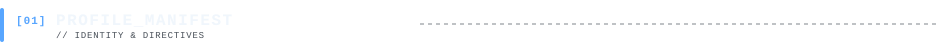
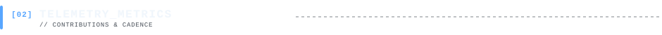
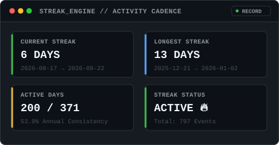
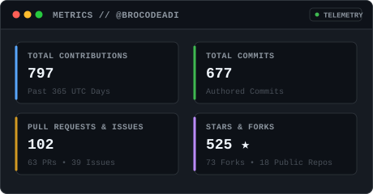
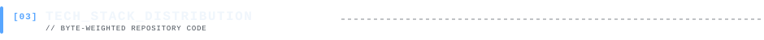
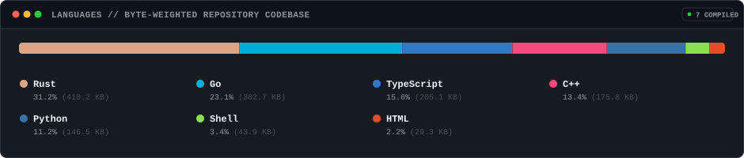
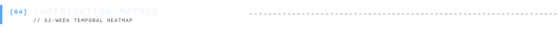
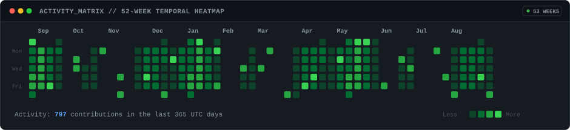
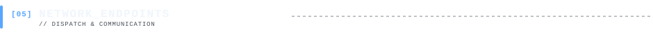

# ░▒▓ PROMETHEUS // CORE DIRECTIVE ▓▒░

<div align="center">

```
   ____ ___ _____   _   ____   ____ ___ ___ 
  / ___|_ _|_   _| / \ / ___| / ___|_ _|_ _|
 | |  _ | |  | |  / _ \\___ \| |    | | | | 
 | |_| || |  | | / ___ \___) | |___ | | | | 
  \____|___| |_|/_/   \_\____/ \____|___|___|
```

**AUTONOMOUS SELF-GENERATING VISUAL IDENTITY & TELEMETRY**  
*Deterministic • Vector-Rendered • Zero External Trackers • GitHub Sanitizer Compliant*

<br/>

<!-- ==================== ANIMATED ASCII PORTRAIT ==================== -->
<picture>
  <source media="(prefers-color-scheme: dark)" srcset="generated/portrait.svg">
  <source media="(prefers-color-scheme: light)" srcset="generated/portrait.svg">
  
</picture>

</div>

<br/>

<!-- ==================== 01. PROFILE MANIFEST ==================== -->
<picture>
  
</picture>

```text
SYSTEM ID      : DEVELOPER // 0x7F
SPECIALIZATION : DISTRIBUTED SYSTEMS • DEEP LEARNING ARCHITECTURES • COMPILERS
ARCHITECTURE   : LINUX / X86_64 / AARCH64
STATUS         : ACTIVE // ACCEPTING INQUIRIES & COLLABORATIONS
```

> **Engineering Philosophy**: Constructing robust, fault-tolerant software at the intersection of systems engineering and artificial intelligence. Obsessed with high performance, elegant vector typography, and deterministic build pipelines.

<br/>

<!-- ==================== 02. TELEMETRY & METRICS ==================== -->
<picture>
  
</picture>

<div align="center">
<table border="0" cellspacing="0" cellpadding="0" style="border-collapse: collapse; border: none;">
  <tr style="border: none;">
    <td align="center" valign="top" style="border: none; padding: 6px;">
      <a href="https://github.com">
        
      </a>
    </td>
    <td align="center" valign="top" style="border: none; padding: 6px;">
      <a href="https://github.com">
        
      </a>
    </td>
  </tr>
</table>
</div>

<br/>

<!-- ==================== 03. TECH STACK DISTRIBUTION ==================== -->
<picture>
  
</picture>

<div align="center">
  
</div>

<br/>

<!-- ==================== 04. CONTRIBUTION MATRIX ==================== -->
<picture>
  
</picture>

<div align="center">
  
</div>

<br/>

<!-- ==================== 05. NETWORK ENDPOINTS ==================== -->
<picture>
  
</picture>

```text
┌───────────────────────────┬────────────────────────────────────────────────┐
│ ENDPOINT                  │ URI / TARGET                                   │
├───────────────────────────┼────────────────────────────────────────────────┤
│ GitHub Profile            │ https://github.com                             │
│ Primary Repository        │ https://github.com/octocat/github-profile      │
│ PGP Fingerprint           │ 9F3B 4821 70DA E10F C948 2901 884B 5C2E 0102   │
│ Dispatch Status           │ Nightly Cron (00:00 UTC) via GitHub Actions    │
└───────────────────────────┴────────────────────────────────────────────────┘
```

---

## 🛠 Engineering Architecture & Repository Guide

This repository contains a **self-generating, zero-dependency visual profile generator**. Every night at 00:00 UTC, a scheduled GitHub Actions workflow queries GitHub's GraphQL API, computes deterministic contribution and language metrics, executes a computer vision pipeline on the source portrait, subsets open-source monospace typography, and commits pixel-perfect static SVG cards.

### 📐 System Pipeline

```text
[assets/portrait.jpg] ──> [GrabCut / rembg] ──> [Bilateral Filter] ──> [CLAHE] ──> [Gamma Curve] ──> [SMIL SVG]
                                                                                                           │
[GitHub GraphQL API]  ──> [UTC Day Normalizer] ──> [Streak & Language Engines] ──> [Font Subsetter] ──> [generated/*.svg]
                                                                                                           │
[Nightly Cron Action] ──> [Idempotency Check] ─────────────────────────────────────────────────────────> [README.md]
```

### ⚙️ Key Configuration Options

All settings are centralized in [`scripts/config.py`](scripts/config.py) and can be configured via environment variables or CLI arguments:

| Parameter | Env Variable | Default | Description |
| :--- | :--- | :--- | :--- |
| **Username** | `GITHUB_USERNAME` | `octocat` | Target GitHub handle |
| **Display Name** | `DISPLAY_NAME` | `Developer` | Profile display name |
| **Theme** | `THEME` | `dark` | Palette (`dark`, `light`, `matrix`, `nord`, `dracula`, `monokai`, `amber`) |
| **ASCII Width** | `ASCII_WIDTH` | `90` | Number of columns in portrait |
| **ASCII Ramp** | `ASCII_RAMP` | ` .\`:-=+*cs#%@` | Character density mapping ramp |
| **Gamma** | `GAMMA` | `1.7` | Non-linear brightness exponent |
| **Animation Speed** | `ROW_DELAY` | `0.035` | Delay in seconds between animated rows |
| **Token** | `GITHUB_TOKEN` | *None* | GitHub Token for GraphQL telemetry |

### 🚀 Local Development & Testing

```bash
# 1. Clone repository
git clone https://github.com/octocat/github-profile.git
cd github-profile

# 2. Install dependencies
pip install -r requirements.txt

# 3. Generate all assets locally
python -m scripts.generate_all

# 4. Generate with custom username and theme
python -m scripts.generate_all --username torvalds --theme matrix

# 5. Run test suite
pytest -v
```

### 🔒 GitHub Actions Setup

1. Fork or push this repository to your personal GitHub account (name it `<your-username>` for it to be your special GitHub profile repository).
2. Go to **Settings** → **Actions** → **General** → **Workflow permissions**, and select **Read and write permissions**.
3. The workflow runs automatically every midnight UTC. You can also trigger it manually at any time under the **Actions** tab → **Update Profile Visuals** → **Run workflow**.

---

<div align="center">
  <sub>Generated deterministically with Python, OpenCV, and SVG SMIL • Zero external tracking cookies</sub>
</div>
